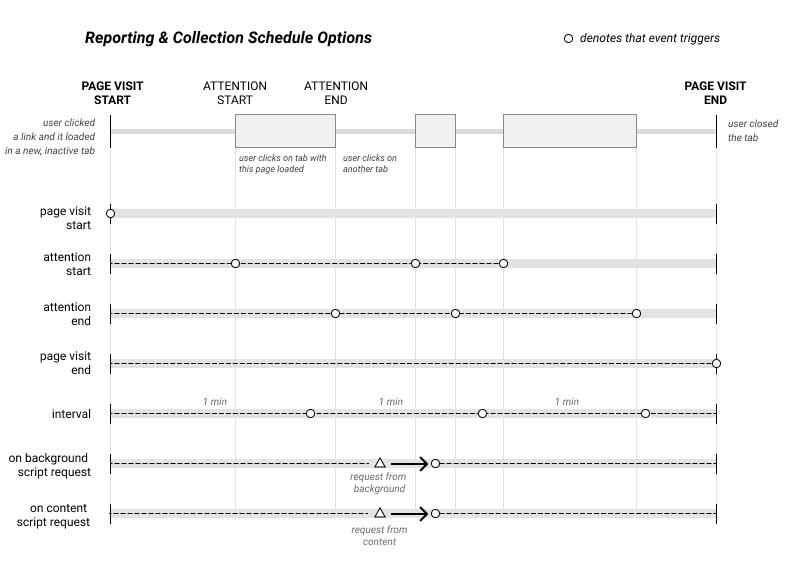

# Microfiche

__NB: this repository is in extreme alpha state.__

`microfiche` helps you collect and gives access to data about how you browse.
You can select any number of modules that collects aspects of your browsing history or build your own
using very simple primitives. You can choose to send the data to an endpoint or just store it locally
to be downloaded later.

The framework is built on CITP's `web-science`, which handles the "attention events" at the root of the framework (see the below section on the [attention model](#the-attention-model)).

## Installing this extension

While this is a framework, the `main` branch of the repository will build an installation-ready web extension for you containing the modules defined in `standard-modules.config.js` (in other words, the `pages`, `events`, and `articles` modules). To get started:

1. fork or clone this repository
2. run `npm install`
3. run `npm run package`
4. if you are
   1. a chrome user: [follow the instructions to load an unpacked web extension](https://developer.chrome.com/docs/extensions/mv2/getstarted/).
   2. a firefox user: 
      1. you'll have to use Nightly. Set `xpinstall.signatures.required` to `false` in `about:config`. 
      2. You can load the add-on from `about:addons`. You will likely get a safety warning in this process.
5. browse for a few days to generate data.
6. Go the the options page and download the data.

## Modules

A data collection module contains two files:
1. a _collector_, which runs on a page and is responsible for collecting page elements, and
2. a _reporter_, which runs in a background script and is responsible for defining the collection schema & doing something with the results.

This repository comes with three modules:

- `pages`, which is the core module behind the framework. This module collects _page visits_ as discrete elements, along with fields such as `title` and `description`. It also records the maximum scroll depth of your page visit. The page visit data collected in other modules should be joined against the `pageId` in this one.
- `events`, which collects all the `attention` and `audio` events triggered by a user a a series of events. An _attention event_ represents the user shifting focus to a specific page visit. We record a "start" and "stop" event when attention changes. An example of "start" events could be that the user triggers a new page load, a new view in an SPA, switches tabs, or switches windows. An example of  "stop" event is when a user closes a tab, ends a page visit by loading a new URL in the tab, closes the window, or lets the browser idle for more than 15 seconds. Because playing video could end up triggering the attention stop event, we also collect when the browser has active unmuted audio playing or not.
- `articles`, which is the first of a series of niche modules. Collects the full-page content & byline of any page that registers as an article by Readability.

Other modules that don't rely on the the attention model are possible, as long as a module has a reporter that emits data.

## Adapters

Every module utilizes some kind of _adapter_, which tells the framework what to do with the collected data. For now, the only adapter is `cache-locally`, which stores the collected data in a namespaced IndexedDB table in the options page. Down the line, we'll additionally add modules to send data to other endpoints.

## The attention model

The below diagram describes the attention model used by this framework. A _page visit_ may have any number of discrete attention or audio events in its lifecycle. This framework gives hooks that enable you to collect or send data at various points in the page visit life cycle.

## Why build this?

A [recent Pew poll](https://www.pewresearch.org/fact-tank/2021/03/26/about-three-in-ten-u-s-adults-say-they-are-almost-constantly-online/) found that "about three-in-ten U.S. adults say they are 'almost constantly online." Whether we like it or not, much of our lives are lived in browsers, and for many of us, desktop browsers have become the interface for our work, our playtime, our distractions, and our socializing. Yet most browser makers treat their product as a commodity. This framework is designed to build intuition through "playtesting" – when we understand ourselves and others through prototyping new data products and trying them out on ourselves and our friends, we build mental models about how people _actually_ use the internet, not just the browser. 

And with that product intuition, maybe we can build browser products that bring joy and control over people's online lives.

### why data collection first?

As Hilary Mason once said, "data products always begin with a careful analysis of an underlying dataset." That's where this framework comes in. It handles the tedious parts of browser mechanics and leaves you to design and collect new datasets. The focus is heavily on _collecting data_, because this is almost always the first step to prototyping new and interesting experiences. By separating the collection from any product prototyping, we can generate _foundational datasets_ that enable us to try out a bunch of things without having to endlessly wait for a user to generate enough data. 

I have used this framework to consistently collect data on my own browsing since around May 2021, and it has been revelatory for me. As a data scientist, I quickly discovered that I am a domain expert in my own browsing. We all are. Yet we probably don't examine all the ways we distract ourselves, how we actually spend our times in this application, and how we cope with online life.

### but what about all the other devices I use?

There are inherent limitations to this framework. For instance, if I use other applications, I lose the tracking. When I switch from my browser to the Slack desktop app, the data collection goes dark. Despite these limitations, I spend an enormous amount of time _in_ the browser, and more and more applications are opting for a web-first experience. Over time, the browser will simply be where we do the vast majority of our work and play.

Another big limitation is that we aren't collecting any mobile data. Platforms like Android and iOS are simply too different for a web extension framework to even be useful on those devices.